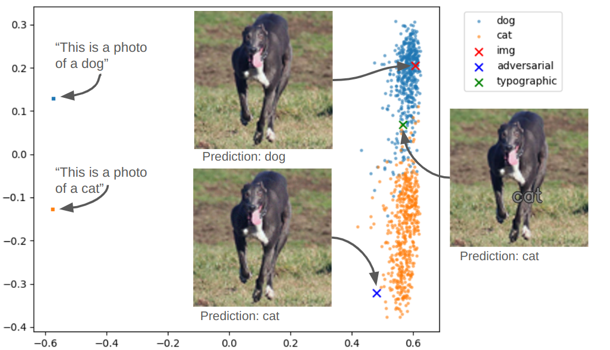

# MultiModelGAPExperiments
Investigate the gap in image-language models
The multimodal gap phenomenon was first introduced in the paper
`Mind the Gap: Understanding the Modality Gap in Multi-modal Contrastive Representation Learning
`

Here I try to play with CLIP and see whether this the GAP affects the zero shot classification ability of such models like CLIP.

CLIP can be a zero shot classifier by comparing the image embedding tothe text embedding of
"A photo of a <object name>" and choosing the closest one

The image bellow shows 2d PCA embedding of image embedding of cats and dogs from a subset of ImageNet. 
On the left you see the text embedding I used for classification. This plot shows the GAP.
I also plot here an adversarial example created from a selected dog image.

Code is not orginized well and more advanced experiments